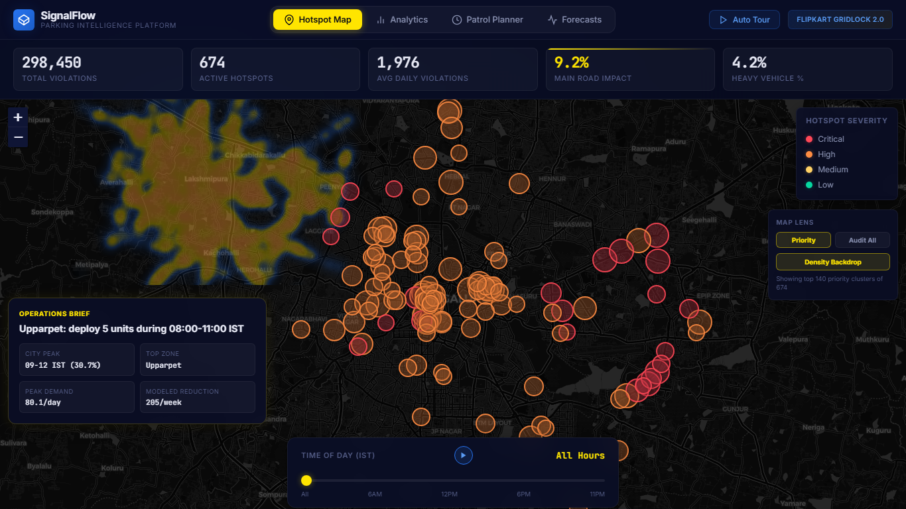
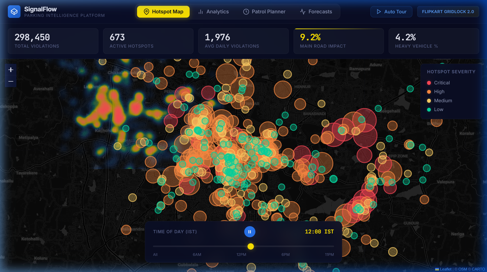
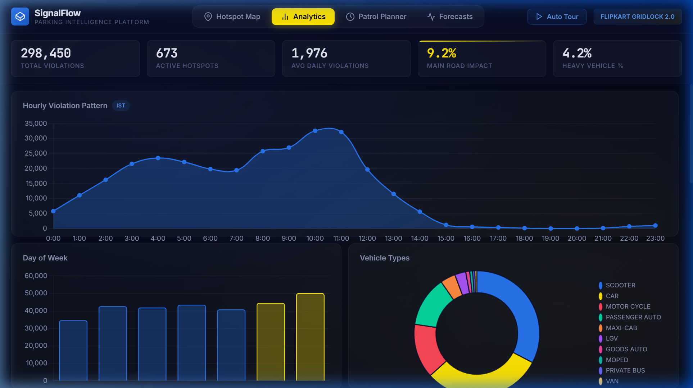
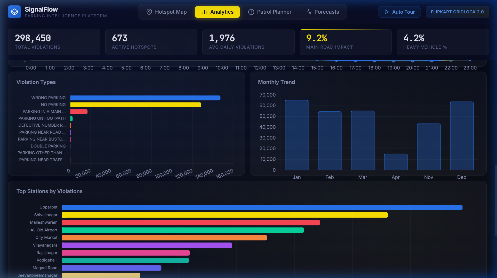
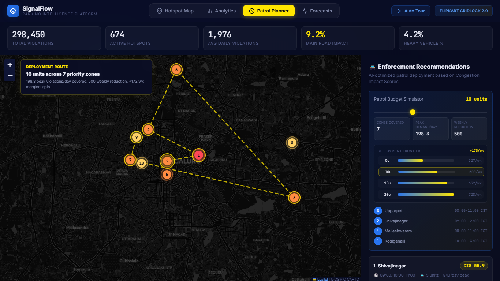
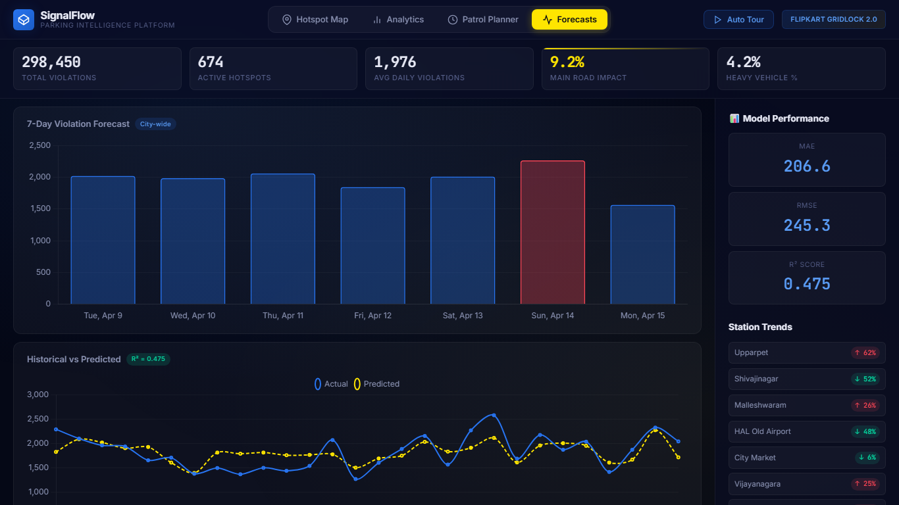

# 🚦 SignalFlow — AI-Powered Parking Intelligence Platform

> **Flipkart Gridlock 2.0 | Round 2 — Theme 1: Parking-Induced Congestion**
>
> **Team SignalFlow**

---

## 🔗 Quick Links

- **Live Demo:** https://ayush-kumar0207.github.io/Flipkart-Gridlock-ParkingIntel/
- **Judge Brief:** [JUDGING_BRIEF.md](JUDGING_BRIEF.md)
- **Run Locally:** `cd dashboard && python -m http.server 8000`

---

## 🎯 Problem Statement

*How can AI-driven parking intelligence detect illegal parking hotspots and quantify their impact on traffic flow to enable targeted enforcement?*

On-street illegal parking and spillover parking near commercial areas, metro stations, and events choke carriageways and intersections. Enforcement is patrol-based and reactive. There is no heatmap of parking violations vs. congestion impact, making it difficult to prioritize enforcement zones.

## 💡 Our Solution

SignalFlow transforms **298,450 real parking violation records** from Bengaluru into actionable intelligence through a 5-stage AI pipeline — from raw data to an interactive, decision-support dashboard.

---

## 📸 Dashboard Preview

### 🗺️ View 1 — Hotspot Map

HDBSCAN-detected violation clusters overlaid on a dark Leaflet map with a subtle density backdrop. The default Priority Lens keeps the judge view clean, while Audit All mode exposes the full cluster set for verification. The bottom time-slider animates violations across a full 24-hour cycle.



### ⏱️ Time Animation (24-Hour Cycle)

Press play to watch violation patterns shift throughout the day. Notice how hotspots intensify during morning rush hours (8–11 AM IST) and dissolve during afternoon lulls — enabling time-aware enforcement scheduling.



### 📊 View 2 — Analytics Dashboard

8 interactive Chart.js visualizations revealing temporal patterns, vehicle-type distributions, violation breakdowns, and enforcement zone rankings — all derived from 298K real records.





### 🚔 View 3 — AI Patrol Planner

AI-optimized enforcement recommendations powered by our reliability-adjusted **Congestion Impact Score (CIS)**. The patrol budget simulator compares 5, 10, 15, and 20-unit deployments, redraws the deployment route on the map, and adds a deployment frontier so reviewers can see marginal weekly gain as patrol capacity increases. The current priority action is Upparpet during 08:00–11:00 IST with 5 units, backed by high-volume repeat demand and a rising trend.



### 📈 View 4 — Violation Forecasts

XGBoost-powered 7-day violation forecasting with model validation metrics. Red bars highlight predicted above-average days. Station trend indicators flag zones with increasing violation pressure (↑) requiring proactive attention.



---

## 🏗️ Architecture

```
┌─────────────────────────────────────────────────────────┐
│                    DATA PIPELINE                        │
│  298,450 violation records → Clean → Feature Extract    │
└───────────────┬─────────────────────────────────────────┘
                │
    ┌───────────┼───────────┬──────────────┐
    ▼           ▼           ▼              ▼
┌────────┐ ┌────────┐ ┌──────────┐ ┌───────────┐
│HDBSCAN │ │Temporal│ │Congestion│ │ XGBoost   │
│Hotspot │ │Pattern │ │ Impact   │ │ Violation │
│Detect  │ │Mining  │ │ Score    │ │ Forecast  │
└───┬────┘ └───┬────┘ └────┬─────┘ └─────┬─────┘
    │          │           │              │
    └──────────┴───────────┴──────────────┘
                      │
              ┌───────▼────────┐
              │  Interactive   │
              │   Dashboard    │
              │ (4 Views)      │
              └────────────────┘
```

### Key Features

| Feature | Description |
|---------|-------------|
| **🗺️ Hotspot Map** | HDBSCAN spatial clustering with priority/audit lenses, severity-coded markers, and 24-hour time animation. |
| **📊 Analytics** | 8 interactive Chart.js visualizations: hourly patterns, day-of-week, vehicle types, violation types, weekday vs weekend, monthly trends, station rankings, daily timeline. |
| **🚔 Patrol Planner** | AI-optimized enforcement recommendations with CIS-scored zones, optimal patrol hours, required units, projected reduction, route overlay, and a clickable deployment frontier. |
| **📈 Forecasts** | XGBoost-powered 7-day violation forecasting per zone with model validation metrics and station trend indicators. |
| **📋 Operations Brief** | Judge-facing decision layer: best first action, city peak window, station playbooks, and 5/10/15/20 unit deployment scenarios. |
| **🎬 Auto Tour** | Built-in guided walkthrough that auto-navigates all 4 views — perfect for live demos and recorded submissions. |

### Novel: Congestion Impact Score (CIS)

```
CIS = raw_score × (0.55 + 0.45 × evidence_confidence)

raw_score = 0.40 × log_violation_density
          + 0.20 × main_road_fraction
          + 0.12 × heavy_vehicle_ratio
          + 0.13 × peak_hour_concentration
          + 0.15 × traffic_window_fraction
```

A weighted composite metric that quantifies how severely each junction/zone's parking violations impact traffic flow. The evidence-confidence adjustment prevents tiny low-sample hotspots from outranking sustained high-impact zones.

---

## 📊 Pipeline Results Summary

| Stage | Output | Key Metrics |
|-------|--------|-------------|
| **Data Processing** | 298,450 records cleaned, 32 features | 27 violation types, IST conversion |
| **Hotspot Detection** | 674 spatial clusters via HDBSCAN | 34 Critical, 303 High, 168 Medium, 169 Low |
| **Impact Scoring** | 50 junctions + 54 stations scored | Top junction: Safina Plaza Junction (CIS=59.6) |
| **Temporal Analysis** | 11 pattern categories | Peak hour: 10:00 IST, Busiest day: Sunday |
| **Forecasting** | 7-day predictions per zone | R²=0.475, MAE=206.6, RMSE=245.3 |
| **Operations Brief** | 10 station playbooks + 4 budget scenarios | City peak window: 09:00–12:00 IST (30.7% of records) |

---

## 🚀 Quick Start

### Prerequisites
- Python 3.9+
- Modern web browser with internet connection (for map tiles)

### Setup & Run

```bash
# 1. Install dependencies
pip install -r requirements.txt

# 2. Run the data pipeline (processes data + trains models + exports JSON)
python run_pipeline.py

# 3. Serve the dashboard
cd dashboard
python -m http.server 8000

# 4. Open http://localhost:8000 in your browser
```

> **💡 Tip:** Pre-generated dashboard JSON is included. A full HDBSCAN pipeline rebuild is an offline preprocessing step and can take several minutes on Windows.

---

## 📁 Project Structure

```
Flipkart-Gridlock-ParkingIntel/
├── data_raw.csv                 # Original dataset (298,450 records)
├── data_clean.csv               # Processed dataset (generated)
├── data_processor.py            # Data cleaning & feature extraction
├── hotspot_engine.py            # HDBSCAN spatial clustering
├── impact_scorer.py             # Congestion Impact Score computation
├── temporal_analyzer.py         # Temporal pattern mining
├── forecaster.py                # XGBoost forecasting & enforcement optimizer
├── operations_brief.py           # Station playbooks + patrol budget scenarios
├── run_pipeline.py              # Single-command pipeline orchestrator
├── requirements.txt             # Python dependencies
├── README.md                    # This file
├── assets/                      # Dashboard screenshots
│   ├── hotspot_map.png
│   ├── hotspot_map_animation.png
│   ├── analytics_top.png
│   ├── analytics_bottom.png
│   ├── patrol_planner.png
│   └── forecasts.png
└── dashboard/
    ├── index.html               # Dashboard UI (4 views + tour)
    ├── style.css                # Dark glassmorphism theme
    ├── app.js                   # Interactive logic + animations
    └── data/                    # Pre-generated JSON (from pipeline)
        ├── stats.json           # KPI summary
        ├── hotspots.json        # 673 cluster definitions
        ├── heatmap_data.json    # 50K lat/lon heatmap points
        ├── hourly_animation.json # Per-hour animation frames
        ├── temporal.json        # Temporal pattern data
        ├── impact_scores.json   # CIS scores per junction/station
        ├── forecasts.json       # 7-day forecast + model metrics
        ├── enforcement.json     # Patrol recommendations
        └── operations_brief.json # Operations brief + budget scenarios
```

---

## 🛠️ Tech Stack

| Layer | Technology |
|-------|-----------|
| **Data Processing** | Pandas, NumPy |
| **Spatial Clustering** | HDBSCAN |
| **Forecasting** | XGBoost |
| **Maps** | Leaflet.js + Leaflet.heat |
| **Charts** | Chart.js 4 |
| **Frontend** | Vanilla HTML/CSS/JS |
| **Map Tiles** | CartoDB Dark Matter |
| **Typography** | Inter, JetBrains Mono (Google Fonts) |

---

## 📊 Dataset Summary

- **298,450** parking violation records from Bengaluru Traffic Police
- **Nov 2023 – Apr 2024** (6 months of data)
- **54** police stations, **169** junctions
- **27** violation types, **22** vehicle types
- Core fields: lat/lon, violation type, vehicle type, timestamp, police station, junction name

---

## 👥 Team

**Team SignalFlow** — Flipkart Gridlock 2.0

---

*Built with ❤️ for Flipkart Gridlock Hackathon 2.0*
